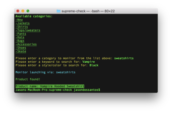

# supremecheck

*Supreme check monitors Supremenewyork.com via keywords and styles that you input and if the item is instock it will return Product Found via console.*

# Future updates
- [ ] Add Discord webhook notifications
- [ ] Add a feature that checks the url via a user set refresh rate

# Requirements
NodeJS 8.11.4 (https://nodejs.org/dist/v8.11.4/node-v8.11.4.pkg)

# How to run
1. Launch Command line (Mac) or Gitbash to folder (Windows)
2. type 'node monitor.js'
3. Enter a Supremenewyork category
4. Enter a keyword
5. Enter a color/style
